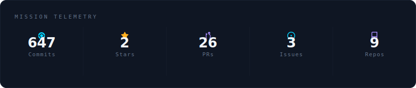

<!-- Galaxy Profile README Template
     Customize this file with your own info, then rename it to README.md
     in your GitHub profile repo (github.com/fgbona).
     The SVG paths below point to assets/generated/ which are auto-generated
     by the GitHub Actions workflow or by running: python -m generator.main -->

  

 

  

 

  

 

  

 

<strong>More about me</strong>

 

DevSecOps engineer specializing in secure, scalable, and automated infrastructure.

I design and operate Kubernetes clusters, multi-cloud environments, and high-performance on-prem systems.
Creator of platforms like Riskentia and Elaboral, focused on security, automation, and distributed architecture.

My work spans infrastructure as code, container orchestration, security hardening, observability, and self-hosted AI systems.

**GitHub:** https://github.com/fgbona  
**Focus areas:** DevSecOps, Kubernetes, Automation, Security, and AI Infrastructure  

 

  
  
  

